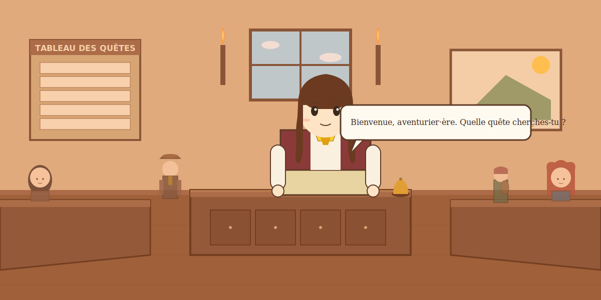

# ⚔️ Guilde des Aventuriers de LeDeutsch ⚔️

*Bienvenue, aventurier·ère. Approchez-vous du comptoir.*

**↑ Cliquez sur la scène pour parler à l'hôtesse et consulter les quêtes.**

---

## 📜 Tableau des Quêtes

| Quête | Rang | Type |
|---|---|---|
| [🩺 Ausculter la Bête de Métal](quests/nethardware/) | ⭐⭐⭐⭐ S | Diagnostic |
| [🈁 Traduire les Runes d'Aincrad](quests/sao-utils/) | ⭐⭐⭐ A | Linguistique |
| [🔐 Enchanter les Sceaux d'Accès](quests/estiam-rfid/) | ⭐⭐⭐ A | Sécurité |
| [📚 Ordonner le Grimoire Unity](quests/unity-hierarchy/) | ⭐⭐ B | Artisanat |
| [🎨 Tisser les Voiles de Style](quests/lulu/) | ⭐⭐ B | Illusion |

---

## 🧭 Qui suis-je ?

Étudiant à **ÉSTIAM**, apprenti bidouilleur — je bricole des outils entre C#, Unity, Web, et hardware monitoring. Ce profil est ma petite guilde : chaque quête ci-dessus **est** un de mes projets, présenté sous forme de mini-défi jouable.

- 🌐 Portfolio : [ledeutsch.github.io](https://ledeutsch.github.io/)
- 📍 Paris

---

<!-- SCENE-META:START -->
🌙 Scène : **sleep** · lumière : **night** · commits 24h : **0** · maj : 2026-07-23 03:38 UTC
<!-- SCENE-META:END -->
