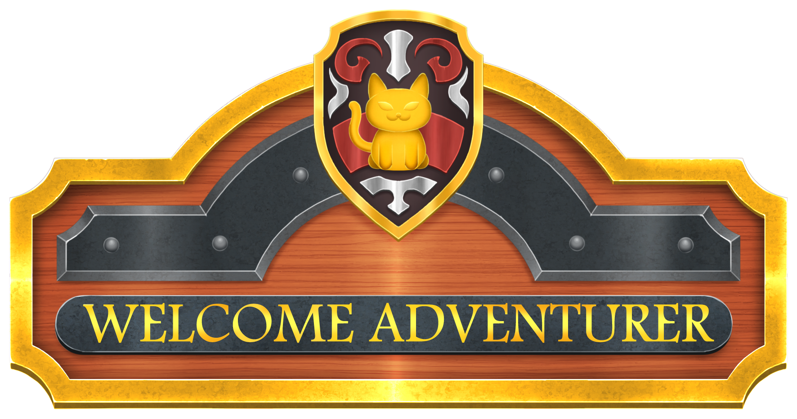

<!-- HEADER BAND: uncomment once Aome delivers the header band asset. -->
<!-- 

 -->

---

*The hostess watches you approach.*

---

<!-- MID BAND: uncomment once Aome delivers the mid band asset. -->
<!-- 

 -->

### What will you do, adventurer?

|  |  |  |
|:---:|:---:|:---:|
| [**Greet her**](dialog/greet.md) | [**Browse the quests**](quests/README.md) | [**Leave her be**](dialog/rest.md) |

---

<!-- FOOTER BAND: uncomment once Aome delivers the footer band asset. -->
<!-- 

 -->

<!-- SCENE-META:START -->
Scene: **idle** · lighting: **evening** · commits (past 24h): **7** · updated: 2026-09-25 21:22 UTC
<!-- SCENE-META:END -->

Art by **[Aome](https://www.fiverr.com/aome_art)** for backgrounds & props, **[VARO](https://www.fiverr.com/varotionist)** for Lucy · commercial use licensed · [CREDITS](CREDITS.md) · [LICENSE](LICENSE)
