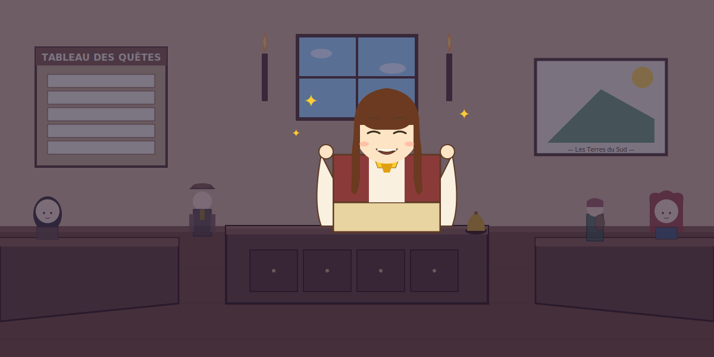

---

> *« Ah, tu veux mon nom ?*
> *Je suis... eh bien, je n'ai pas encore de nom !*
> *Ludwig n'a pas encore choisi. Reviens plus tard, peut-être qu'il aura décidé. »*

*(Note du dev : le nom de l'hôtesse sera choisi dans une prochaine session — voir [docs/ROADMAP.md](../docs/ROADMAP.md))*

---

### 💬 Suite du dialogue

|  |  |
|:---:|:---:|
| [😊 **Enchanté(e) quand même**](greet.md) | [👋 **Retour au comptoir**](../README.md) |

